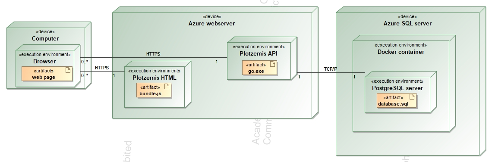

## Uždavinio aprašymas

Projekto tema – miesto plėtros sistema

### Sistemos paskirtis

Sistema skirta pildyti ir peržiūrėti miesto plėtros informaciją. 


Naujos gatvės registruojamos į sistemą. Kiekviena gatvė turi informaciją apie joje esamus sklypus. 

Kiekvienas sklypas papildomai saugo informaciją apie sklypo statinius(butas, namas, aikštelė, t.t...).


### Funkciniai reikalavimai

Naudotojai skirstomi į tris roles.

Svečias gali:
1.	Prisiregistruoti.
2.	Peržiūrėti informaciją apie individualias gatves, sklypus, statinius.
3.	Gauti sąrašą gatvių, sklypų, statinių.
4.	Gauti sklypą, atsižvelgiant į gatvę
5.	Gauti statinį atsižvelgiant į gatvę ir sklypą.

Registruotas vartotojas gali:
1.	Tą patį ką ir svečias (negali tik prisiregistruoti)
2.	Prisijungti.
3.	Atsijungti.
4.	Sudaryti naują gatvės/sklypo/statinio įrašą:
4.1.	Atnaujint savo įrašo informaciją,
4.2.	ištrinti savo įrašą,

Administratorius gali:
1.	Turi tas pačias teises kaip registruotas vartotojas.
2.	Sukurti daugiau administratoriaus rolės vartotojų
3.	Panaikinti kitų vartotojų įrašus.

## Sistemos architektūra

Žemiau vaiduojama diegimo diagrama. 


Aplikacija bei jos duomenų bazė talpinama į Azure. Iš „Plotzemis HTML“ per https parsisiunčiama kliento pusės logika (bundle.js), kuri vykdoma kliento kompiuteryje, naršyklėje. Naršyklė pateikia tinklapio puslapį ir bendrauja su API per https protokolą. Tuo tarpu, duomenų bazė talpinama į docker konteinerį ir pasiekiama per tcp (angl.) „port“ 5432



## Naudotojo sąsajos projektas

## API specifikacija

### street

#### /api/user/street POST

##### URL

##### Resurso informacija

| Formatas      | Description |
| ----------- | ----------- |
| Reikalauja autentifikacijos?      | Title       |
| Reikalauja administratoriaus teisių?   | Text        |

##### Parametrai

| Parametras      | Privalomas | Aprašas | numatyta reikšmė | Pavyzdys |
| ----------- | ----------- | ----------- | ----------- | ----------- |
|       |        |     |     |     |
|    |         |     |     |     |

##### Pavyzdinė užklausa

```

```

##### Pavyzdinis atsakymas

```

```

#### /api/street GET

##### URL

##### Resurso informacija

| Formatas      | Description |
| ----------- | ----------- |
| Reikalauja autentifikacijos?      | Title       |
| Reikalauja administratoriaus teisių?   | Text        |

##### Parametrai

| Parametras      | Privalomas | Aprašas | numatyta reikšmė | Pavyzdys |
| ----------- | ----------- | ----------- | ----------- | ----------- |
|       |        |     |     |     |
|    |         |     |     |     |

##### Pavyzdinė užklausa

```

```

##### Pavyzdinis atsakymas

```

```

#### /api/street/all GET

##### URL

##### Resurso informacija

| Formatas      | Description |
| ----------- | ----------- |
| Reikalauja autentifikacijos?      | Title       |
| Reikalauja administratoriaus teisių?   | Text        |

##### Parametrai

| Parametras      | Privalomas | Aprašas | numatyta reikšmė | Pavyzdys |
| ----------- | ----------- | ----------- | ----------- | ----------- |
|       |        |     |     |     |
|    |         |     |     |     |

##### Pavyzdinė užklausa

```

```

##### Pavyzdinis atsakymas

```

```

#### /api/user/street PUT

##### URL

##### Resurso informacija

| Formatas      | Description |
| ----------- | ----------- |
| Reikalauja autentifikacijos?      | Title       |
| Reikalauja administratoriaus teisių?   | Text        |

##### Parametrai

| Parametras      | Privalomas | Aprašas | numatyta reikšmė | Pavyzdys |
| ----------- | ----------- | ----------- | ----------- | ----------- |
|       |        |     |     |     |
|    |         |     |     |     |

##### Pavyzdinė užklausa

```

```

##### Pavyzdinis atsakymas

```

```

#### /api/user/street REMOVE

##### URL

##### Resurso informacija

| Formatas      | Description |
| ----------- | ----------- |
| Reikalauja autentifikacijos?      | Title       |
| Reikalauja administratoriaus teisių?   | Text        |

##### Parametrai

| Parametras      | Privalomas | Aprašas | numatyta reikšmė | Pavyzdys |
| ----------- | ----------- | ----------- | ----------- | ----------- |
|       |        |     |     |     |
|    |         |     |     |     |

##### Pavyzdinė užklausa

```

```

##### Pavyzdinis atsakymas

```

```

#### /api/admin/street REMOVE

##### URL

##### Resurso informacija

| Formatas      | Description |
| ----------- | ----------- |
| Reikalauja autentifikacijos?      | Title       |
| Reikalauja administratoriaus teisių?   | Text        |

##### Parametrai

| Parametras      | Privalomas | Aprašas | numatyta reikšmė | Pavyzdys |
| ----------- | ----------- | ----------- | ----------- | ----------- |
|       |        |     |     |     |
|    |         |     |     |     |

##### Pavyzdinė užklausa

```

```

##### Pavyzdinis atsakymas

```

```


### Plot

#### /api/user/plot POST

##### URL

##### Resurso informacija

| Formatas      | Description |
| ----------- | ----------- |
| Reikalauja autentifikacijos?      | Title       |
| Reikalauja administratoriaus teisių?   | Text        |

##### Parametrai

| Parametras      | Privalomas | Aprašas | numatyta reikšmė | Pavyzdys |
| ----------- | ----------- | ----------- | ----------- | ----------- |
|       |        |     |     |     |
|    |         |     |     |     |

##### Pavyzdinė užklausa

```

```

##### Pavyzdinis atsakymas

```

```

#### /api/admin/street REMOVE

##### URL

##### Resurso informacija

| Formatas      | Description |
| ----------- | ----------- |
| Reikalauja autentifikacijos?      | Title       |
| Reikalauja administratoriaus teisių?   | Text        |

##### Parametrai

| Parametras      | Privalomas | Aprašas | numatyta reikšmė | Pavyzdys |
| ----------- | ----------- | ----------- | ----------- | ----------- |
|       |        |     |     |     |
|    |         |     |     |     |

##### Pavyzdinė užklausa

```

```

##### Pavyzdinis atsakymas

```

```

#### /api/plot GET

##### URL

##### Resurso informacija

| Formatas      | Description |
| ----------- | ----------- |
| Reikalauja autentifikacijos?      | Title       |
| Reikalauja administratoriaus teisių?   | Text        |

##### Parametrai

| Parametras      | Privalomas | Aprašas | numatyta reikšmė | Pavyzdys |
| ----------- | ----------- | ----------- | ----------- | ----------- |
|       |        |     |     |     |
|    |         |     |     |     |

##### Pavyzdinė užklausa

```

```

##### Pavyzdinis atsakymas

```

```

#### /api/admin/street REMOVE

##### URL

##### Resurso informacija

| Formatas      | Description |
| ----------- | ----------- |
| Reikalauja autentifikacijos?      | Title       |
| Reikalauja administratoriaus teisių?   | Text        |

##### Parametrai

| Parametras      | Privalomas | Aprašas | numatyta reikšmė | Pavyzdys |
| ----------- | ----------- | ----------- | ----------- | ----------- |
|       |        |     |     |     |
|    |         |     |     |     |

##### Pavyzdinė užklausa

```

```

##### Pavyzdinis atsakymas

```

```

#### /api/plot/all GET

##### URL

##### Resurso informacija

| Formatas      | Description |
| ----------- | ----------- |
| Reikalauja autentifikacijos?      | Title       |
| Reikalauja administratoriaus teisių?   | Text        |

##### Parametrai

| Parametras      | Privalomas | Aprašas | numatyta reikšmė | Pavyzdys |
| ----------- | ----------- | ----------- | ----------- | ----------- |
|       |        |     |     |     |
|    |         |     |     |     |

##### Pavyzdinė užklausa

```

```

##### Pavyzdinis atsakymas

```

```

#### /api/admin/street REMOVE

##### URL

##### Resurso informacija

| Formatas      | Description |
| ----------- | ----------- |
| Reikalauja autentifikacijos?      | Title       |
| Reikalauja administratoriaus teisių?   | Text        |

##### Parametrai

| Parametras      | Privalomas | Aprašas | numatyta reikšmė | Pavyzdys |
| ----------- | ----------- | ----------- | ----------- | ----------- |
|       |        |     |     |     |
|    |         |     |     |     |

##### Pavyzdinė užklausa

```

```

##### Pavyzdinis atsakymas

```

```

#### /api/user/plot PUT

##### URL

##### Resurso informacija

| Formatas      | Description |
| ----------- | ----------- |
| Reikalauja autentifikacijos?      | Title       |
| Reikalauja administratoriaus teisių?   | Text        |

##### Parametrai

| Parametras      | Privalomas | Aprašas | numatyta reikšmė | Pavyzdys |
| ----------- | ----------- | ----------- | ----------- | ----------- |
|       |        |     |     |     |
|    |         |     |     |     |

##### Pavyzdinė užklausa

```

```

##### Pavyzdinis atsakymas

```

```

#### /api/admin/street REMOVE

##### URL

##### Resurso informacija

| Formatas      | Description |
| ----------- | ----------- |
| Reikalauja autentifikacijos?      | Title       |
| Reikalauja administratoriaus teisių?   | Text        |

##### Parametrai

| Parametras      | Privalomas | Aprašas | numatyta reikšmė | Pavyzdys |
| ----------- | ----------- | ----------- | ----------- | ----------- |
|       |        |     |     |     |
|    |         |     |     |     |

##### Pavyzdinė užklausa

```

```

##### Pavyzdinis atsakymas

```

```

#### /api/user/plot REMOVE

##### URL

##### Resurso informacija

| Formatas      | Description |
| ----------- | ----------- |
| Reikalauja autentifikacijos?      | Title       |
| Reikalauja administratoriaus teisių?   | Text        |

##### Parametrai

| Parametras      | Privalomas | Aprašas | numatyta reikšmė | Pavyzdys |
| ----------- | ----------- | ----------- | ----------- | ----------- |
|       |        |     |     |     |
|    |         |     |     |     |

##### Pavyzdinė užklausa

```

```

##### Pavyzdinis atsakymas

```

```

#### /api/admin/street REMOVE

##### URL

##### Resurso informacija

| Formatas      | Description |
| ----------- | ----------- |
| Reikalauja autentifikacijos?      | Title       |
| Reikalauja administratoriaus teisių?   | Text        |

##### Parametrai

| Parametras      | Privalomas | Aprašas | numatyta reikšmė | Pavyzdys |
| ----------- | ----------- | ----------- | ----------- | ----------- |
|       |        |     |     |     |
|    |         |     |     |     |

##### Pavyzdinė užklausa

```

```

##### Pavyzdinis atsakymas

```

```

#### /api/admin/plot REMOVE

##### URL

##### Resurso informacija

| Formatas      | Description |
| ----------- | ----------- |
| Reikalauja autentifikacijos?      | Title       |
| Reikalauja administratoriaus teisių?   | Text        |

##### Parametrai

| Parametras      | Privalomas | Aprašas | numatyta reikšmė | Pavyzdys |
| ----------- | ----------- | ----------- | ----------- | ----------- |
|       |        |     |     |     |
|    |         |     |     |     |

##### Pavyzdinė užklausa

```

```

##### Pavyzdinis atsakymas

```

```

#### /api/admin/street REMOVE

##### URL

##### Resurso informacija

| Formatas      | Description |
| ----------- | ----------- |
| Reikalauja autentifikacijos?      | Title       |
| Reikalauja administratoriaus teisių?   | Text        |

##### Parametrai

| Parametras      | Privalomas | Aprašas | numatyta reikšmė | Pavyzdys |
| ----------- | ----------- | ----------- | ----------- | ----------- |
|       |        |     |     |     |
|    |         |     |     |     |

##### Pavyzdinė užklausa

```

```

##### Pavyzdinis atsakymas

```

```


### Building

#### /api/user/building POST

##### URL

##### Resurso informacija

| Formatas      | Description |
| ----------- | ----------- |
| Reikalauja autentifikacijos?      | Title       |
| Reikalauja administratoriaus teisių?   | Text        |

##### Parametrai

| Parametras      | Privalomas | Aprašas | numatyta reikšmė | Pavyzdys |
| ----------- | ----------- | ----------- | ----------- | ----------- |
|       |        |     |     |     |
|    |         |     |     |     |

##### Pavyzdinė užklausa

```

```

##### Pavyzdinis atsakymas

```

```

#### /api/admin/street REMOVE

##### URL

##### Resurso informacija

| Formatas      | Description |
| ----------- | ----------- |
| Reikalauja autentifikacijos?      | Title       |
| Reikalauja administratoriaus teisių?   | Text        |

##### Parametrai

| Parametras      | Privalomas | Aprašas | numatyta reikšmė | Pavyzdys |
| ----------- | ----------- | ----------- | ----------- | ----------- |
|       |        |     |     |     |
|    |         |     |     |     |

##### Pavyzdinė užklausa

```

```

##### Pavyzdinis atsakymas

```

```

#### /api/building GET

##### URL

##### Resurso informacija

| Formatas      | Description |
| ----------- | ----------- |
| Reikalauja autentifikacijos?      | Title       |
| Reikalauja administratoriaus teisių?   | Text        |

##### Parametrai

| Parametras      | Privalomas | Aprašas | numatyta reikšmė | Pavyzdys |
| ----------- | ----------- | ----------- | ----------- | ----------- |
|       |        |     |     |     |
|    |         |     |     |     |

##### Pavyzdinė užklausa

```

```

##### Pavyzdinis atsakymas

```

```

#### /api/admin/street REMOVE

##### URL

##### Resurso informacija

| Formatas      | Description |
| ----------- | ----------- |
| Reikalauja autentifikacijos?      | Title       |
| Reikalauja administratoriaus teisių?   | Text        |

##### Parametrai

| Parametras      | Privalomas | Aprašas | numatyta reikšmė | Pavyzdys |
| ----------- | ----------- | ----------- | ----------- | ----------- |
|       |        |     |     |     |
|    |         |     |     |     |

##### Pavyzdinė užklausa

```

```

##### Pavyzdinis atsakymas

```

```

#### /api/building/all GET

##### URL

##### Resurso informacija

| Formatas      | Description |
| ----------- | ----------- |
| Reikalauja autentifikacijos?      | Title       |
| Reikalauja administratoriaus teisių?   | Text        |

##### Parametrai

| Parametras      | Privalomas | Aprašas | numatyta reikšmė | Pavyzdys |
| ----------- | ----------- | ----------- | ----------- | ----------- |
|       |        |     |     |     |
|    |         |     |     |     |

##### Pavyzdinė užklausa

```

```

##### Pavyzdinis atsakymas

```

```

#### /api/admin/street REMOVE

##### URL

##### Resurso informacija

| Formatas      | Description |
| ----------- | ----------- |
| Reikalauja autentifikacijos?      | Title       |
| Reikalauja administratoriaus teisių?   | Text        |

##### Parametrai

| Parametras      | Privalomas | Aprašas | numatyta reikšmė | Pavyzdys |
| ----------- | ----------- | ----------- | ----------- | ----------- |
|       |        |     |     |     |
|    |         |     |     |     |

##### Pavyzdinė užklausa

```

```

##### Pavyzdinis atsakymas

```

```

#### /api/user/building PUT

##### URL

##### Resurso informacija

| Formatas      | Description |
| ----------- | ----------- |
| Reikalauja autentifikacijos?      | Title       |
| Reikalauja administratoriaus teisių?   | Text        |

##### Parametrai

| Parametras      | Privalomas | Aprašas | numatyta reikšmė | Pavyzdys |
| ----------- | ----------- | ----------- | ----------- | ----------- |
|       |        |     |     |     |
|    |         |     |     |     |

##### Pavyzdinė užklausa

```

```

##### Pavyzdinis atsakymas

```

```

#### /api/admin/street REMOVE

##### URL

##### Resurso informacija

| Formatas      | Description |
| ----------- | ----------- |
| Reikalauja autentifikacijos?      | Title       |
| Reikalauja administratoriaus teisių?   | Text        |

##### Parametrai

| Parametras      | Privalomas | Aprašas | numatyta reikšmė | Pavyzdys |
| ----------- | ----------- | ----------- | ----------- | ----------- |
|       |        |     |     |     |
|    |         |     |     |     |

##### Pavyzdinė užklausa

```

```

##### Pavyzdinis atsakymas

```

```

#### /api/user/building REMOVE

##### URL

##### Resurso informacija

| Formatas      | Description |
| ----------- | ----------- |
| Reikalauja autentifikacijos?      | Title       |
| Reikalauja administratoriaus teisių?   | Text        |

##### Parametrai

| Parametras      | Privalomas | Aprašas | numatyta reikšmė | Pavyzdys |
| ----------- | ----------- | ----------- | ----------- | ----------- |
|       |        |     |     |     |
|    |         |     |     |     |

##### Pavyzdinė užklausa

```

```

##### Pavyzdinis atsakymas

```

```

#### /api/admin/street REMOVE

##### URL

##### Resurso informacija

| Formatas      | Description |
| ----------- | ----------- |
| Reikalauja autentifikacijos?      | Title       |
| Reikalauja administratoriaus teisių?   | Text        |

##### Parametrai

| Parametras      | Privalomas | Aprašas | numatyta reikšmė | Pavyzdys |
| ----------- | ----------- | ----------- | ----------- | ----------- |
|       |        |     |     |     |
|    |         |     |     |     |

##### Pavyzdinė užklausa

```

```

##### Pavyzdinis atsakymas

```

```

#### /api/user/building REMOVE ADMIN

##### URL

##### Resurso informacija

| Formatas      | Description |
| ----------- | ----------- |
| Reikalauja autentifikacijos?      | Title       |
| Reikalauja administratoriaus teisių?   | Text        |

##### Parametrai

| Parametras      | Privalomas | Aprašas | numatyta reikšmė | Pavyzdys |
| ----------- | ----------- | ----------- | ----------- | ----------- |
|       |        |     |     |     |
|    |         |     |     |     |

##### Pavyzdinė užklausa

```

```

##### Pavyzdinis atsakymas

```

```

#### /api/admin/street REMOVE

##### URL

##### Resurso informacija

| Formatas      | Description |
| ----------- | ----------- |
| Reikalauja autentifikacijos?      | Title       |
| Reikalauja administratoriaus teisių?   | Text        |

##### Parametrai

| Parametras      | Privalomas | Aprašas | numatyta reikšmė | Pavyzdys |
| ----------- | ----------- | ----------- | ----------- | ----------- |
|       |        |     |     |     |
|    |         |     |     |     |

##### Pavyzdinė užklausa

```

```

##### Pavyzdinis atsakymas

```

```


## Išvados

- 
- 
- 

## Šaltiniai

- https://www.bezkoder.com/react-typescript-login-example/
- https://www.npmjs.com/package/bootstrap/v/4.6.0
- https://formik.org/docs/guides/validation
- https://github.com/jquense/yup
- https://medium.com/@apzuk3/input-validation-in-golang-bc24cdec1835
- https://www.digitalocean.com/community/tutorials/react-manage-user-login-react-context
- https://levelup.gitconnected.com/microservices-with-go-grpc-api-gateway-and-authentication-part-1-2-393ad9fc9d30
- https://getbootstrap.com/
- https://react-bootstrap.github.io/getting-started/introduction
- https://stackoverflow.com/questions/49967779/axios-handling-errors