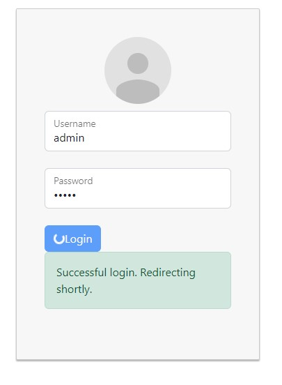
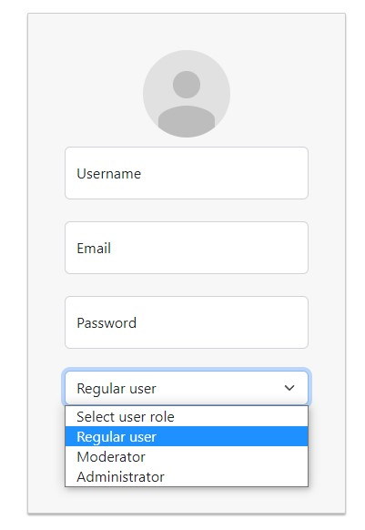
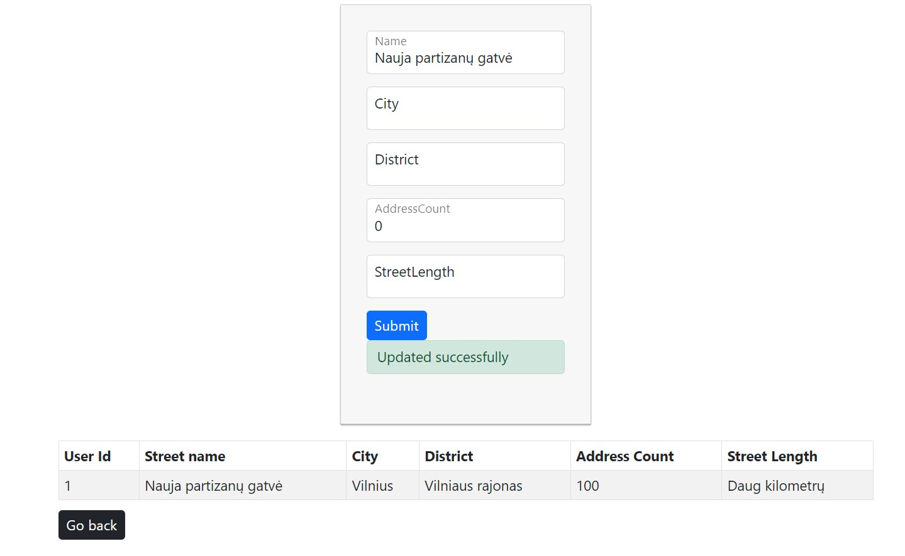
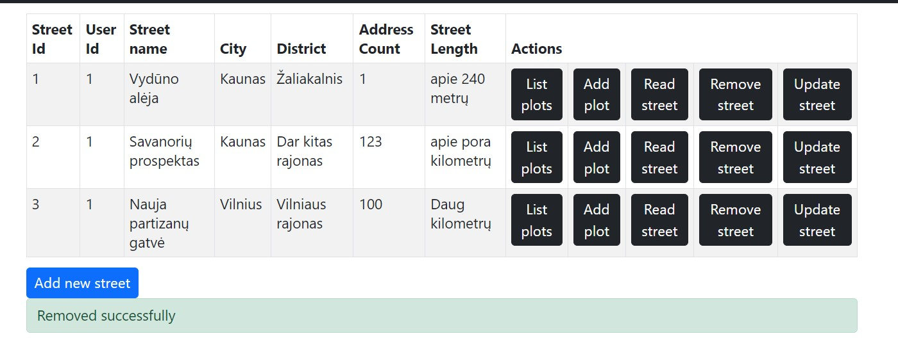

## Uždavinio aprašymas

Projekto tema – miesto plėtros sistema

### Sistemos paskirtis

Sistema skirta pildyti ir peržiūrėti miesto plėtros informaciją. 


Naujos gatvės registruojamos į sistemą. Kiekviena gatvė turi informaciją apie joje esamus sklypus. 

Kiekvienas sklypas papildomai saugo informaciją apie sklypo statinius(butas, namas, aikštelė, t.t...).


### Funkciniai reikalavimai

Naudotojai skirstomi į tris roles.

Svečias gali:
1.	Prisiregistruoti.
2.	Peržiūrėti informaciją apie individualias gatves, sklypus, statinius.
3.	Gauti sąrašą gatvių, sklypų, statinių.
4.	Gauti sklypą, atsižvelgiant į gatvę
5.	Gauti statinį atsižvelgiant į gatvę ir sklypą.

Registruotas vartotojas gali:
1.	Tą patį ką ir svečias (negali tik prisiregistruoti)
2.	Prisijungti.
3.	Atsijungti.
4.	Sudaryti naują gatvės/sklypo/statinio įrašą:

4.1.	Atnaujint savo įrašo informaciją,

4.2.	ištrinti savo įrašą,

Administratorius gali:
1.	Turi tas pačias teises kaip registruotas vartotojas.
2.	Sukurti daugiau administratoriaus rolės vartotojų
3.	Panaikinti kitų vartotojų įrašus.

## Sistemos architektūra

Žemiau vaiduojama diegimo diagrama. 


Aplikacija bei jos duomenų bazė talpinama į Azure. Iš „Plotzemis HTML“ per https parsisiunčiama kliento pusės logika (bundle.js), kuri vykdoma kliento kompiuteryje, naršyklėje. Naršyklė pateikia tinklapio puslapį ir bendrauja su API per https protokolą. Tuo tarpu, duomenų bazė talpinama į docker konteinerį ir pasiekiama per tcp (angl.) „port“ 5432


## Naudotojo sąsajos projektas

### Login

Prisijungus, "Login" mygtukas pradeda suktis ir po dviejų sekundžių nukreipia į vartotojo profilio puslapį.



### Register

`Admin` vartotojas gali sukurti daugiau skirtingas teises turinčių vartotojų.



### Logout

Atsijungti galima paspaudus `dropdow` mygtuką.


### List

Sąrašas pateikiamas lentelės forma.


### Create

Atliekama įvedamų duomenų validacija.


### Read

Nuskaičius įrašą, šis pateikiamas lentelės forma.


### Update

Įrašus gali keisti tik vartotojas, kuris juos sukūrė.



### Remove

Įrašus naikinti gali administratoriai ir vartotojai, kurie juos sukūrė.




## API specifikacija

Kiekvienas api POST/PUT metodas papildomai atlieka duomenų validaciją, kad neužpildytų duomenų bazės tuščiais duomenimis.

### street

#### /api/street POST

##### URL

```
http://localhost:9090/api/street
```

##### Resurso informacija

| Formatas      | Description |
| ----------- | ----------- |
| Reikalauja autentifikacijos?      | ne       |
| Reikalauja administratoriaus teisių?   | ne        |

##### Parametrai

| Parametras      | Privalomas | Aprašas | numatyta reikšmė | Pavyzdys |
| ----------- | ----------- | ----------- | ----------- | ----------- |
| name | taip | gatvės pavadinimas |  | partizanu g.50 |
| city | taip | miestas, kuriame gatvė |  | Kaunas |
| district | taip | rajonas, kuriame gatvė |  | Žaliakalnis |
| postalCode | taip | pašto kodas | 0 | 56485 |
| addressCount | taip | adresų skaičius gatvėje | 0 | 123 |
| streetLength | taip | gatvės ilgis | 0 | apie 240 metrų |

##### Pavyzdinė užklausa

```
curl -X POST 'http://localhost:9090/api/street' \
-H 'Accept: application/json' \
-H "Authorization: Bearer ${TOKEN}" \
-d '
{
    "name":"partizanu g.50",
    "city":"Kaunas",
    "district":"Žaliakalnis",
    "postalCode":"56485",
    "addressCount":123,
    "streetLength":"apie 240 metrų"
}
'
```

##### Pavyzdinis atsakymas

```
{
    "userId": 1
}{
    "result": {
        "Id": 1,
        "userId": 1,
        "name": "partizanu g.50",
        "city": "Kaunas",
        "district": "Žaliakalnis",
        "postalCode": "56485",
        "addressCount": 123,
        "streetLength": "apie 240 metrų"
    },
    "success": "true"
}
```

Atsako kodas: 200

#### /api/street/:streetID GET

##### URL

```
http://localhost:9090/api/street/:streetID
```

##### Resurso informacija

| Formatas      | Description |
| ----------- | ----------- |
| Reikalauja autentifikacijos?      | ne       |
| Reikalauja administratoriaus teisių?   | ne        |
| Gali vykdyti tik savo įrašams?   | ne        |

##### Parametrai

| Parametras      | Privalomas | Aprašas | numatyta reikšmė | Pavyzdys |
| ----------- | ----------- | ----------- | ----------- | ----------- |
| name | taip | gatvės pavadinimas |  | partizanu g.50 |

##### Pavyzdinė užklausa

```
curl -X GET 'http://127.0.0.1:9090/api/street/1' \
-H 'Accept: application/json' \
```

##### Pavyzdinis atsakymas

```
{
    "result": {
        "Id": 1,
        "userId": 1,
        "name": "partizanu g.50",
        "city": "Kaunas",
        "district": "Žaliakalnis",
        "postalCode": "56485",
        "addressCount": 123,
        "streetLength": "apie 240 metrų"
    },
    "success": "true"
}
```

Atsako kodas: 200

#### /api/street/ GET

##### URL

```
http://localhost:9090/api/street/
```

##### Resurso informacija

| Formatas      | Description |
| ----------- | ----------- |
| Reikalauja autentifikacijos?      | ne       |
| Reikalauja administratoriaus teisių?   | ne        |
| Gali vykdyti tik savo įrašams?   | ne        |

##### Parametrai

| Parametras      | Privalomas | Aprašas | numatyta reikšmė | Pavyzdys |
| ----------- | ----------- | ----------- | ----------- | ----------- |
| nereikia parametrų  |

##### Pavyzdinė užklausa

```
curl -X GET 'http://localhost:9090/api/street/' \
-H 'Accept: application/json'
```

##### Pavyzdinis atsakymas

```
{
    "result": [
        {
            "Id": 1,
            "userId": 1,
            "name": "partizanu g.50",
            "city": "Kaunas",
            "district": "Žaliakalnis",
            "postalCode": "56485",
            "addressCount": 123,
            "streetLength": "apie 240 metrų"
        },
        {
            "Id": 2,
            "userId": 1,
            "name": "partizanu g.501",
            "city": "Kaunas",
            "district": "Žaliakalnis",
            "postalCode": "56485",
            "addressCount": 123,
            "streetLength": "apie 240 metrų"
        },
        {
            "Id": 3,
            "userId": 1,
            "name": "savanoriu prospektas",
            "city": "Kaunas",
            "district": "Žaliakalnis",
            "postalCode": "56485",
            "addressCount": 123,
            "streetLength": "apie 240 metrų"
        }
    ],
    "success": "true"
}
```

Atsako kodas: 200

#### /api/street/:streetID PUT

##### URL

```
http://localhost:9090/api/user/street/
```

##### Resurso informacija

| Formatas      | Description |
| ----------- | ----------- |
| Reikalauja autentifikacijos?      | taip       |
| Reikalauja administratoriaus teisių?   | ne        |
| Gali vykdyti tik savo įrašams?   | taip        |

##### Parametrai

| Parametras      | Privalomas | Aprašas | numatyta reikšmė | Pavyzdys |
| ----------- | ----------- | ----------- | ----------- | ----------- |
| oldName | taip | pavadinimas prieš pakeitimą |  | savanoriu prospektas |
| newName | ne | pavadinimas po pakeitimo |  | Vilniaus gatve |
| postalCode | ne | pašto kodas |  | 12345 |
| addressCount | ne | adresų skaičius gatvėje |  | 101 |

##### Pavyzdinė užklausa

```
curl -X PUT 'http://localhost:9090/api/street/1' \
-H 'Accept: application/json' \
-H "Authorization: Bearer ${TOKEN}" \
-d '
{
    "name":"Vilniaus gatve",
    "postalCode":"12345",
    "addressCount": 101
}
'
```

##### Pavyzdinis atsakymas

```
{
    "userId": 1
}{
    "result": {
        "Id": 3,
        "userId": 1,
        "name": "Vilniaus gatve",
        "city": "Kaunas",
        "district": "Žaliakalnis",
        "postalCode": "12345",
        "addressCount": 101,
        "streetLength": "apie 240 metrų"
    },
    "success": "true"
}
```

Atsako kodas: 200

#### /api/street/:streetID REMOVE

##### URL

```
http://127.0.0.1:9090/api/street/:streetID
```

##### Resurso informacija

| Formatas      | Description |
| ----------- | ----------- |
| Reikalauja autentifikacijos?      | taip       |
| Reikalauja administratoriaus teisių?   | ne        |
| Gali vykdyti tik savo įrašams?   | taip        |

##### Parametrai

| Parametras      | Privalomas | Aprašas | numatyta reikšmė | Pavyzdys |
| ----------- | ----------- | ----------- | ----------- | ----------- |
| name | taip | gatvės pavadinimas |  | partizanu g.50 |

##### Pavyzdinė užklausa

```
curl -X DELETE 'http://localhost:9090/api/street/1' \
-H 'Accept: application/json' \
-H "Authorization: Bearer ${TOKEN}"
```

##### Pavyzdinis atsakymas

```
{
    "userId": 1
}{
    "result": "Street as well as plots and buildings associated with it have been removed",
    "success": "true"
}
```

Atsako kodas: 200

### Plot

#### /api/street/:streetID POST

##### URL

```
http://localhost:9090/api/street/:streetID
```

##### Resurso informacija

| Formatas      | Description |
| ----------- | ----------- |
| Reikalauja autentifikacijos?      | taip       |
| Reikalauja administratoriaus teisių?   | ne        |

##### Parametrai

| Parametras      | Privalomas | Aprašas | numatyta reikšmė | Pavyzdys |
| ----------- | ----------- | ----------- | ----------- | ----------- |
| lotNo | taip | ploto numeris | 0 | 52 |
| areaSize | taip | žemės plotas arais | 0 | 20 |
| purpose | taip | ploto paskirtis. Gali būti sandėliss/gyvenamasis/agrikultūrinis/miškininkystės |  | agrikultūrinis |
| type | taip | ploto tipas. Gali būti nuomojamas/parduodamas/neparduodamas |  | neparduodamas |

##### Pavyzdinė užklausa

```
curl -X POST 'http://localhost:9090/api/street/1' \
-H 'Accept: application/json' \
-H "Authorization: Bearer ${TOKEN}" \
-d '
{
    "lotNo":110,
    "areaSize":5,
    "purpose":"Gyvenamasis",
    "type":"parduodamas"
}
'
```

##### Pavyzdinis atsakymas

```
{
    "userId": 1
}{
    "result": {
        "Id": 1,
        "userId": 1,
        "streetId": 1,
        "lotNo": 110,
        "areaSize": 5,
        "purpose": "Gyvenamasis",
        "type": "parduodamas"
    },
    "success": "true"
}
```

Atsako kodas: 200

#### /api/street/:streetID/:plotID GET

##### URL

```
http://localhost:9090/api/street/:streetID/:plotID
```

##### Resurso informacija

| Formatas      | Description |
| ----------- | ----------- |
| Reikalauja autentifikacijos?      | ne       |
| Reikalauja administratoriaus teisių?   | ne        |
| Gali vykdyti tik savo įrašams?   | ne        |

##### Parametrai

| Parametras      | Privalomas | Aprašas | numatyta reikšmė | Pavyzdys |
| ----------- | ----------- | ----------- | ----------- | ----------- |

##### Pavyzdinė užklausa

```
curl -X GET 'http://127.0.0.1:9090/api/street/12/7' \
-H 'Accept: application/json'
```

##### Pavyzdinis atsakymas

```
{
    "result": {
        "Id": 7,
        "userId": 1,
        "streetId": 12,
        "lotNo": 110,
        "areaSize": 5,
        "purpose": "Gyvenamasis",
        "type": "parduodamas"
    },
    "success": "true"
}
```

Atsako kodas: 200

#### /api/street/:streetID/ GET

##### URL

```
http://localhost:9090/api/street/:streetID/
```

##### Resurso informacija

| Formatas      | Description |
| ----------- | ----------- |
| Reikalauja autentifikacijos?      | ne       |
| Reikalauja administratoriaus teisių?   | ne        |
| Gali vykdyti tik savo įrašams?   | ne        |

##### Parametrai

| Parametras      | Privalomas | Aprašas | numatyta reikšmė | Pavyzdys |
| ----------- | ----------- | ----------- | ----------- | ----------- |
| neturi parametrų |

##### Pavyzdinė užklausa

```
curl -X GET 'http://localhost:9090/api/street/7/' \
-H 'Accept: application/json'
```

##### Pavyzdinis atsakymas

```
{
    "result": [
        {
            "Id": 1,
            "userId": 1,
            "streetId": 7,
            "lotNo": 110,
            "areaSize": 5,
            "purpose": "Gyvenamasis",
            "type": "parduodamas"
        },
        {
            "Id": 2,
            "userId": 1,
            "streetId": 7,
            "lotNo": 8,
            "areaSize": 20,
            "purpose": "Gyvenamasis",
            "type": "neparduodamas"
        },
        {
            "Id": 3,
            "userId": 1,
            "streetId": 7,
            "lotNo": 52,
            "areaSize": 20,
            "purpose": "sandėlis",
            "type": "neparduodamas"
        },
        {
            "Id": 4,
            "userId": 1,
            "streetId": 7,
            "lotNo": 52,
            "areaSize": 20,
            "purpose": "agrikultūrinis",
            "type": "neparduodamas"
        }
    ],
    "success": "true"
}
```

Atsako kodas: 200

#### /api/street/:streetID/:plotID PUT

##### URL

```
http://localhost:9090/api/street/:streetID/:plotID
```

##### Resurso informacija

| Formatas      | Description |
| ----------- | ----------- |
| Reikalauja autentifikacijos?      | taip       |
| Reikalauja administratoriaus teisių?   | ne        |
| Gali vykdyti tik savo įrašams?   | taip        |

##### Parametrai

| Parametras      | Privalomas | Aprašas | numatyta reikšmė | Pavyzdys |
| ----------- | ----------- | ----------- | ----------- | ----------- |
| lotNo | taip | ploto numeris | 0 | 52 |
| areaSize | ne | žemės plotas arais | 0 | 20 |
| purpose | ne | ploto paskirtis. Gali būti sandėliss/gyvenamasis/agrikultūrinis/miškininkystės |  | agrikultūrinis |
| type | ne | ploto tipas. Gali būti nuomojamas/parduodamas/neparduodamas |  | neparduodamas |

##### Pavyzdinė užklausa

```
curl -X PUT 'http://localhost:9090/api/street/7/8' \
-H 'Accept: application/json' \
-H "Authorization: Bearer ${TOKEN}" \
-d '
{
    "streetId":7,
    "plotId":8,
    "areaSize":1000,
    "purpose":"Gyvenamasis",
    "type":"parduodamas"
}
'
```

##### Pavyzdinis atsakymas

```
{
    "userId": 1
}{
    "result": {
        "Id": 1,
        "userId": 1,
        "streetId": 7,
        "lotNo": 110,
        "areaSize": 1000,
        "purpose": "Gyvenamasis",
        "type": "parduodamas"
    },
    "success": "true"
}
```

Atsako kodas: 200

#### /api/street/:streetID/:plotID REMOVE

##### URL

```
http://localhost:9090/api/street/:streetID/:plotID
```

##### Resurso informacija

| Formatas      | Description |
| ----------- | ----------- |
| Reikalauja autentifikacijos?      | taip       |
| Reikalauja administratoriaus teisių?   | ne        |
| Gali vykdyti tik savo įrašams?   | taip        |

##### Parametrai

| Parametras      | Privalomas | Aprašas | numatyta reikšmė | Pavyzdys |
| ----------- | ----------- | ----------- | ----------- | ----------- |
|  |  |  |  |  |
|  |  |  |  |  |

##### Pavyzdinė užklausa

```
curl -X DELETE 'http://127.0.0.1:9090/api/street/5/13' \
-H 'Accept: application/json' \
-H "Authorization: Bearer ${TOKEN}"
```

##### Pavyzdinis atsakymas

```
{
    "userId": 1
}{
    "result": "Plot as well as buildings present in this plot have been removed",
    "success": "true"
}
```

Atsako kodas: 200

### Building

#### /api/street/:streetID/:plotID/ POST

##### URL

```
http://localhost:9090/api/street/:streetID/:plotID/
```

##### Resurso informacija

| Formatas      | Description |
| ----------- | ----------- |
| Reikalauja autentifikacijos?      | taip       |
| Reikalauja administratoriaus teisių?   | ne        |

##### Parametrai

| Parametras      | Privalomas | Aprašas | numatyta reikšmė | Pavyzdys |
| ----------- | ----------- | ----------- | ----------- | ----------- |
| streetNumber | taip | pastato gatvės numeris |  | 25A |
| type | taip | Pastato tipas. Pavyzdžiui butas, garažas, namas. Parametro pasirinkimai neribojami |  | butas |
| areaSize | taip | plotas kvadratiniais metrais | 0 | 5 |
| floorCount | taip | aukštų skaičius. Bus 0, jeigu pastatas yra aikštelė ar panašiai | 0 | 10 |
| year | taip | metai, kada buvo pastatytas | 0 | 1999 |
| price | taip | kaina eurais | 0 | 234232 |

##### Pavyzdinė užklausa

```
curl -X POST 'http://localhost:9090/api/street/5/15' \
-H 'Accept: application/json' \
-H "Authorization: Bearer ${TOKEN}" \
-d '
{
    "streetId":5,
    "plotId":15,
    "lotNo":110,
    "streetId":5,
    "plotId":15,
    "type":"butas",
    "areaSize":5,
    "floorCount":10,
    "year":1999,
    "price":234232
}
'
```

##### Pavyzdinis atsakymas

```
{
    "userId": 1
}{
    "result": {
        "Id": 1,
        "userId": 1,
        "streetId":5,
        "plotId":15,
        "streetNumber": "25A",
        "type": "butas",
        "areaSize": 5,
        "floorCount": 10,
        "year": 1999,
        "price": 234232
    },
    "success": "true"
}
```

Atsako kodas: 200

#### /api/street/:streetID/:plotID/:buildingID GET

##### URL

```
http://localhost:9090/api/street/:streetID/:plotID/:buildingID
```

##### Resurso informacija

| Formatas      | Description |
| ----------- | ----------- |
| Reikalauja autentifikacijos?      | ne       |
| Reikalauja administratoriaus teisių?   | ne        |
| Gali vykdyti tik savo įrašams?   | ne        |

##### Parametrai

| Parametras      | Privalomas | Aprašas | numatyta reikšmė | Pavyzdys |
| ----------- | ----------- | ----------- | ----------- | ----------- |

##### Pavyzdinė užklausa

```
curl -X GET 'http://127.0.0.1:9090/api/street/16/5/1' \
-H 'Accept: application/json'
```

##### Pavyzdinis atsakymas

```
{
    "error": "building with this streetId, plotId and buildingId not found"
}
```

Atsako kodas: 404

#### /api/street/:streetID/:plotID/ GET

##### URL

```
http://localhost:9090/api/street/:streetID/:plotID/
```

##### Resurso informacija

| Formatas      | Description |
| ----------- | ----------- |
| Reikalauja autentifikacijos?      | ne       |
| Reikalauja administratoriaus teisių?   | ne        |
| Gali vykdyti tik savo įrašams?   | ne        |

##### Parametrai

| Parametras      | Privalomas | Aprašas | numatyta reikšmė | Pavyzdys |
| ----------- | ----------- | ----------- | ----------- | ----------- |
| nereikia parametrų |

##### Pavyzdinė užklausa

```
curl -X GET 'http://localhost:9090/api/street/12/7/' \
-H 'Accept: application/json'
```

##### Pavyzdinis atsakymas

```
{
    "result": [
        {
            "Id": 1,
            "userId": 1,
            "streetId":12,
            "plotId":7,
            "lotNo": 110,
            "streetNumber": "25A",
            "type": "butas",
            "areaSize": 5,
            "floorCount": 10,
            "year": 1999,
            "price": 234232
        },
        {
            "Id": 2,
            "userId": 1,
            "streetId":12,
            "plotId":7,
            "lotNo": 110,
            "streetNumber": "25A",
            "type": "butas",
            "areaSize": 5,
            "floorCount": 10,
            "year": 1999,
            "price": 234232
        }
    ],
    "success": "true"
}
```

Atsako kodas: 200

#### /api/street/:streetID/:plotID/:buildingID PUT

##### URL

```
http://localhost:9090/api/street/:streetID/:plotID/:buildingID
```

##### Resurso informacija

| Formatas      | Description |
| ----------- | ----------- |
| Reikalauja autentifikacijos?      | taip       |
| Reikalauja administratoriaus teisių?   | ne        |
| Gali vykdyti tik savo įrašams?   | taip        |

##### Parametrai

| Parametras      | Privalomas | Aprašas | numatyta reikšmė | Pavyzdys |
| ----------- | ----------- | ----------- | ----------- | ----------- |
| streetNumber | taip | pastato gatvės numeris |  | 25A |
| type | ne | Pastato tipas. Pavyzdžiui butas, garažas, namas. Parametro pasirinkimai neribojami |  | butas |
| areaSize | ne | plotas kvadratiniais metrais | 0 | 5 |
| floorCount | ne | aukštų skaičius. Bus 0, jeigu pastatas yra aikštelė ar panašiai | 0 | 10 |
| year | ne | metai, kada buvo pastatytas | 0 | 1999 |
| price | ne | kaina eurais | 0 | 234232 |

##### Pavyzdinė užklausa

```
curl -X PUT 'http://localhost:9090/api/street/12/7/3' \
-H 'Accept: application/json' \
-H "Authorization: Bearer ${TOKEN}" \
-d '
{
    "streetId":12,
    "plotId":7,
    "streetNumber":"25A",
    "year":2001,
    "price":234232
}
'
```

##### Pavyzdinis atsakymas

```
{
    "userId": 1
}{
    "result": {
        "Id": 1,
        "userId": 1,
        "streetId":12,
        "plotId":7,
        "streetNumber": "25A",
        "type": "butas",
        "areaSize": 5,
        "floorCount": 10,
        "year": 2001,
        "price": 234232
    },
    "success": "true"
}
```

Atsako kodas: 200

#### /api/street/:streetID/:plotID/:buildingID REMOVE

##### URL

```
http://localhost:9090/api/street/:streetID/:plotID/:buildingID
```

##### Resurso informacija

| Formatas      | Description |
| ----------- | ----------- |
| Reikalauja autentifikacijos?      | taip       |
| Reikalauja administratoriaus teisių?   | ne        |
| Gali vykdyti tik savo įrašams?   | taip        |

##### Parametrai

| Parametras      | Privalomas | Aprašas | numatyta reikšmė | Pavyzdys |
| ----------- | ----------- | ----------- | ----------- | ----------- |

##### Pavyzdinė užklausa

```
curl -X DELETE 'http://127.0.0.1:9090/api/street/14/14/7' \
-H 'Accept: application/json' \
-H "Authorization: Bearer ${TOKEN}"
```

##### Pavyzdinis atsakymas

```
{
    "userId": 1
}{
    "result": "Post removed",
    "success": "true"
}
```

Atsako kodas: 200

## Išvados

- Atsako kodai aiškiai pateikia, kokia galima problema, net jeigu negrąžinamas užklausos kūnas
- Frontend'o aplikacija turi gebėti dinamiškai prisitaikyti prie įvairių įrenginio apribojimų. Pakeitus naršyklės lango dydį, frontend'as neturėtų sugriūti.
- Patogiau aplikaciją įkelti į cloud'ą, jeigu ji supakuota į docker konteinerį. Arba jeigu dar kitaip galima suautomatizuoti programos paleidimą.
- Būtina duomenų validacija backend'o pusėje. Neužtenka pasitikėti, jog frontend'o pusės perduodami duomenys bus tinkami.

## Šaltiniai

- https://www.bezkoder.com/react-typescript-login-example/
- https://www.npmjs.com/package/bootstrap/v/4.6.0
- https://formik.org/docs/guides/validation
- https://github.com/jquense/yup
- https://medium.com/@apzuk3/input-validation-in-golang-bc24cdec1835
- https://www.digitalocean.com/community/tutorials/react-manage-user-login-react-context
- https://levelup.gitconnected.com/microservices-with-go-grpc-api-gateway-and-authentication-part-1-2-393ad9fc9d30
- https://getbootstrap.com/
- https://react-bootstrap.github.io/getting-started/introduction
- https://stackoverflow.com/questions/49967779/axios-handling-errors
- https://github.com/briancodex/react-sidebar-dropdown